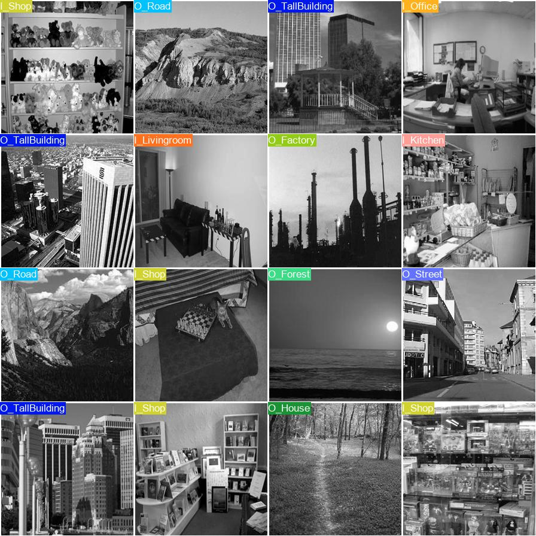
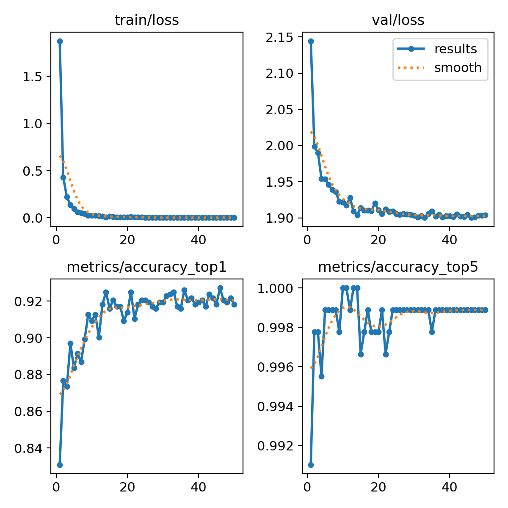

# YOLOv8 Scene Classification for LLM Assistance
  

## Description
This project applies **YOLOv8** for **scene classification**, enabling large language models (LLMs) to receive structured scene context (e.g., *forest, city street, office, classroom*).  
By integrating scene understanding, LLMs can reason more effectively about images, videos, or multimodal tasks.

## Tools
- Python  
- YOLOv8 (Ultralytics)  
- PyTorch  
- OpenCV

